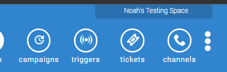
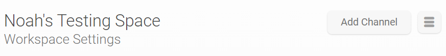
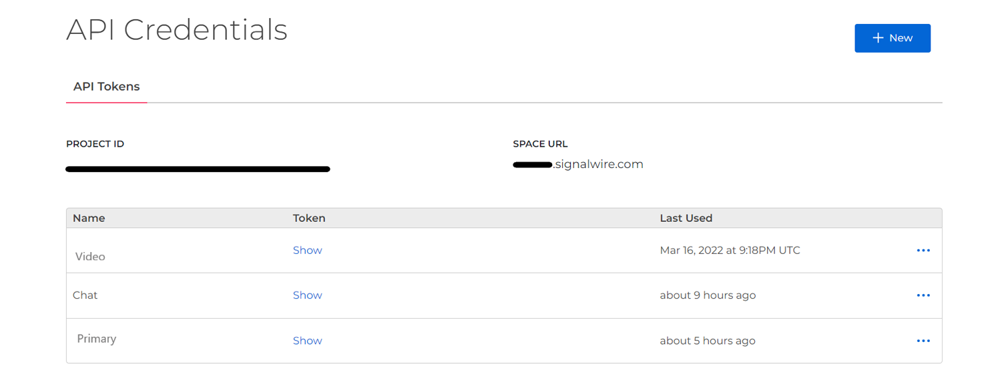
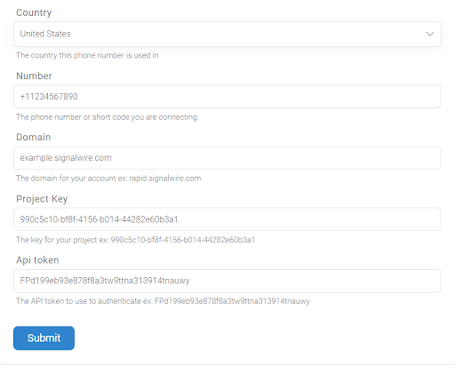
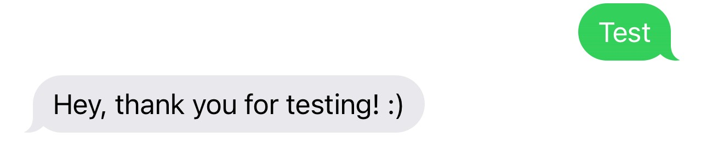

# Setting up Textit for SignalWire
A quick and easy step by step guide to link SignalWire to Textit! 

With the power of SignalWire and the simplicity of Textit, texting has never been so easy!

## Getting Started with SignalWire
If you use a 10DLC number (Long-code) and you’re going to be sending texts into/from the United States, we will first need to register our phone number to a campaign! The campaign registration process ensures that all text will follow the guidelines from the carriers to prevent spam. We have a fantastic document going in-depth about the process and a FAQ. [Click here to be redirected.](https://developer.signalwire.com/apis/docs/campaign-registry-all-you-need-to-know)

If you choose to use a toll-free number, you will need to verify this number. This will give your use-case to the carriers. The same way the campaign registration process does. This document goes in-depth on the verification process and frequently asked questions regarding it. [Click here to be redirected.](https://developer.signalwire.com/apis/docs/toll-free-number-overview)

After deciding what type of number you want to use (10DLC or Toll-Free) and completing the registration process depending on the number type, we can begin using textit!

## Getting Started with Textit
Now that we have gotten our number set up for texting, we can begin using Textit! [Once you are on Textit's site](https://www.textit.com/org/signup/), and you have made your message flow, click on your account’s name in the upper right corner. 

Now you should see your account’s overview page. At the top, you will see a button labeled “Add Channel” press this button. 

You will now see a few choices, press the SignalWire option. This will open up a page to input your phone number, SignalWire Space URL, Project ID, and API Token.

## Getting Your API Token

To find this info you will need to go to your SignalWire Space again. Once at your SignalWire Space, press “API” on the left-hand sidebar. If you haven’t already made a API token, press new in the upper right corner. Feel free to name this whatever you want, just ensure it has messaging permissions.

## Finishing up

After your API token is created, press show and copy the string of text and paste it into the slot “API Token” on Textit. Rinse and repeat with the other options. “Project ID” to “Project Key” and “Space URL” to “Domain”. Finally, the only thing left is the phone number that you bought from SignalWire.  Please enter the phone number in the E164 format. (E164 looks like this +18723055810)

Here is an example of what this should look like after you’re all done.

## Congrats!

After pressing submit, you're all set to begin sending and receiving texts! From here you can follow Textit guides on message flows or create your own! With SignalWire and Textit, you have unlimited potential with your messaging campaigns!

