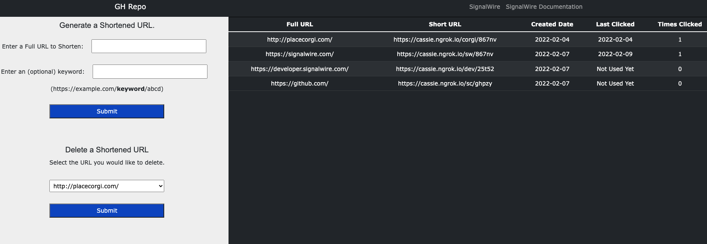

# Overview 
SMS Marketing is one of the most effective ways to reach consumers in a format they prefer, but every character counts when it comes to messaging. A common solution is to use a public URL shortener like bit.ly, cutt.ly, or tiny.cc. The problem with these public URL shorteners is that the carriers typically flag messages containing their URLs as spam since it is disallowed content!

This application shows how **easy** it is to set up your own private URL shortener allowing you to generate and redirect shortened URLs, keep track of their usage, and most importantly you will be following all of the [carrier rules regarding shortened URLs](https://developer.signalwire.com/apis/docs/sms-best-practices-how-to-ensure-message-delivery#shortened-urls)! 

# What do I need to run this code?

This application doesn't require much - you will need [Python](https://www.python.org/), the [Flask framework](https://www.tutorialspoint.com/python_web_development_libraries/python_web_development_libraries_flask_framework.htm), and a [ngrok tunnel](https://developer.signalwire.com/apis/docs/how-to-test-webhooks-with-ngrok) to reach your localhost or server to host it on. 

# How to Run Application 

To run the application, execute `export FLASK_APP=main.py` then run `flask run`.

You may need to use an SSH tunnel for testing this code – we recommend [ngrok](https://ngrok.com/). After starting the tunnel, you can use the URL you receive from `ngrok` in your webhook configuration for your phone number.

# Sign Up Here

If you would like to test this example out, you can create a SignalWire account and space [here](https://m.signalwire.com/signups/new?s=1).

Please feel free to reach out to us on our [Community Slack](https://signalwire.community/) or create a Support ticket if you need guidance!