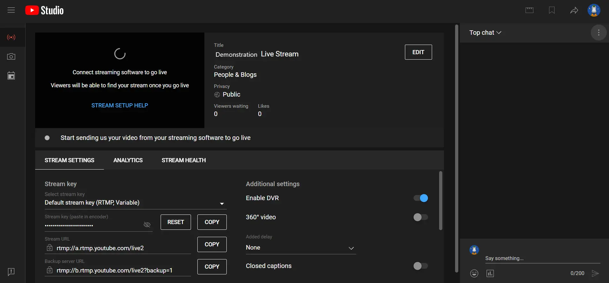

# RTMP Outbound Streaming from a Programmable Video Conference

SignalWire's JavaScript Video SDK supports outbound streaming from a video conference room to an external RTMP URL.

This example uses a [Programmable Video Conference](https://developer.signalwire.com/guides/video-conferences) (PVC) and the [SignalWire Video SDK for Javascript](https://developer.signalwire.com/sdks/reference/browser-sdk/video/) to create a PVC with the ability to stream to an external site such as YouTube, Facebook, or Twitch.

📖 [Read the full RTMP guide](https://developer.signalwire.com/guides/video/streaming-to-youtube-and-other-platforms)

## Prerequisites

To run this demo, you need to find the RTMP URL from whichever streaming service you want to stream to. The URL is usually on a live stream setup page. On YouTube, that page looks like this:

Some streaming services have a stream key in addition to the URL. If your service includes a stream key, note that as well. The final RTMP URL you will need to use concatenates the two with a / like this: `rtmp://<stream_url>/<stream_key>`.

## Running the Application

Run this application locally with the following steps:

- install the dependencies with `npm install`
- start the application with `npm start`

## Get started with SignalWire

To reproduce this application, start by creating a [new SignalWire account](https://m.signalwire.com/signups/new?s=1). Your account may be in trial mode, which starts you with a credit of $5.00. You can find more information on the [Trial Mode resource page](https://developer.signalwire.com/apis/docs/trial-mode).

If you want more information about the possibilities with SignalWire, visit our [Developer Home Page](https://developer.signalwire.com/) to see our products, guides, and reference material.

Please feel free to reach out to the [Community](signalwire.community) or create a Support ticket if you need guidance!
