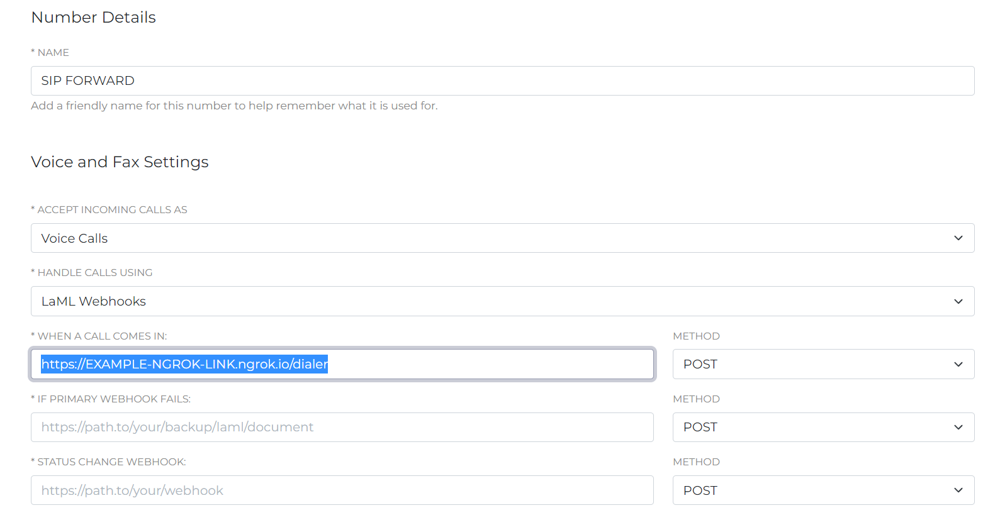
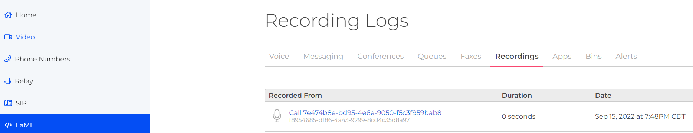

# SIP Voicemail

Overview
------------------------------
Having a voicemail is crucial to get back in touch and today, we're going to bring it over to our SIP calls!

What do you need to run this code?
----------------------------------
You will need the [SignalWire Node.JS SDK](https://docs.signalwire.com/topics/laml-api/#laml-rest-api-client-libraries-and-sdks-nodejs).

The application also uses the [Express](https://expressjs.com/en/starter/installing.html) web framework and [Ngrok](https://www.npmjs.com/package/ngrok#local-install) to expose our webhook to the internet.

You can find the full application on GitHub right [here](https://github.com/NoahConder/SIP_Voicemail/blob/main/Voice_mail.js)!

Step by Step Code Walkthrough
-----------------------------
```javascript
const express = require("express");
const { RestClient } = require('@signalwire/node')
const ngrok = require('ngrok');
(async function() {
  const url = await ngrok.connect();
  console.log(url + "/dialer")
})();

function formatUrl(action, querystring = '') {
  return "/" + action + querystring;
}

function respondAndLog(res, response) {
  console.log(response.toString());
  res.send(response.toString());
}

// Starting the app
const app = express();
app.use(express.urlencoded());

app.listen(process.env.PORT || 80, () => {
 console.log("Server running on port 80");
});
```
We start with importing our packages and start our server to expose our port to the
internet. As I mentioned earlier, this application uses [Ngrok](https://developer.signalwire.com/guides/how-to-test-webhooks-with-ngrok/) to help get this done.

```javascript
// App routes
app.post("/dialer", (req, res, next) => {
    console.log(req.body);
    let response = new RestClient.LaML.VoiceResponse();
    dial = response.dial({timeout: 20, action: formatUrl('voicemail')});
    dial.sip("sip:SIP_ENDPOINT_GOES_HERE");
    console.log(req.body);
  if (req.body.DialCallStatus != "completed") {
      // it means the call was not answered
      dial = response.dial({timeout: 20, action: formatUrl('hangup')});
  }
  respondAndLog(res, response);
});
```
This portion is where the application dials the SIP endpoint and checks if the call was completed or not.
This allows it to decide if sending it to voicemail is necessary.
We will add the SIP endpoint we want to dial here. You can see it in the section
`dial.sip("sip:SIP_ENDPOINT_GOES_HERE");`

```javascript
app.post("/voicemail", (req, res, next) => {
    let response = new RestClient.LaML.VoiceResponse();
    if (req.body.DialCallStatus != "completed") {
    // it means the call was not answered
    response.say("I am currently unavailable, please leave a message.")
    response.record({transcribe: true, action: 'hangup'})
  }
  respondAndLog(res, response);
 });
```
Here is the actual voicemail itself. You can edit this message to anything you want to be said.
It will automatically hang up as well after a few of seconds of silence.
It can also transcribe the voicemail. You can disable transcription by
removing `transcribe: true,` from the above code.
```javascript
  app.post("/hangup", (req, res, next) => {
      let response = new RestClient.LaML.VoiceResponse();
      respondAndLog(res, response);
});
```
Finally, for the very last portion of the application, we have a simple hangup bin.

Setting up the Webhook
----------------------
Boot the application up and copy the Ngrok link from the console and go to your SignalWire Space.
From here go to your phone numbers tab on the left-hand sidebar. 
Choose the number you'd like to dial your SIP endpoint and go into the settings of it by clicking on it.
You should see the following:



We will need to ensure our settings are as follows:

1. "Accept incoming calls as" needs to be "Voice Calls"
2. "Handle Calls Using" is set to "LaML Webhooks".
3. Paste our Ngrok link from our application in the "When a call comes in" section.


You can also see above for an example of how it should look when finished.

How to Access the Recordings
----------------------------

To access your recordings, click the **LaML** tab on the left-hand side nav. Click **Recordings**, and you will be able to view, listen, and download your recording files. You will also see the call ID and recording ID that you can use to [access recordings via our API](https://developer.signalwire.com/compatibility-api/reference/retrieve_recording). 



Wrapping up
-----------
You officially have SIP Voicemail! Give the number a test dial and see
the results of your hard work. Looking for even more functionality on your SIP voicemail? Check out this [amazing guide](https://developer.signalwire.com/guides/nodejs-ivr-with-voicemail-to-email/)!
You can also find further information regarding voicemail [here](https://developer.signalwire.com/guides/how-to-set-up-voicemail/).
