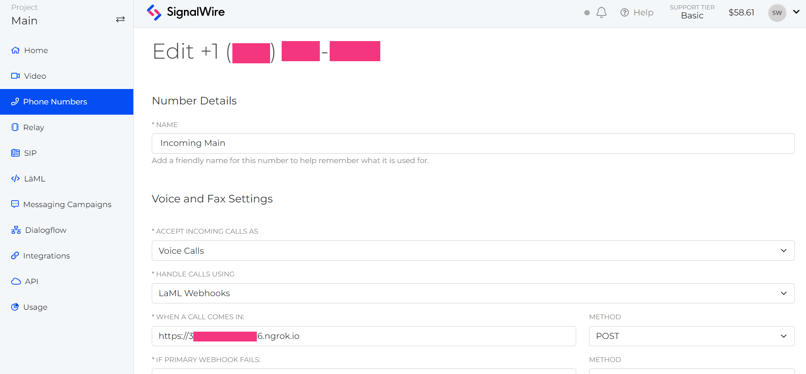

# SIP Voicemail with Python

Having voicemail available is an important part of any phone system, and calls
to SIP endpoints are no exception. This example will show how to automatically
record SIP voicemails with the
[Compatibility SDK with Python](https://docs.signalwire.com/reference/compatibility-sdks/v3/#compatibility-rest-api-client-libraries-and-sdks-python).

We will configure a DID (SignalWire phone number) to accept incoming calls and
dial our SIP endpoint, then record a voicemail if the call is unanswered. You
can clone this repo to test and alter to meet your needs.

## Setup Your Environment

Copy the contents of `env.example` and save them in a new file called `.env`.
Fill in your SignalWire credentials. If you need help finding them, check out
our guide to
[Navigating Your SignalWire Space](https://developer.signalwire.com/guides/navigating-your-space#api).
The Compatibility SDK will pull these environmental variables from the `.env`
file without any import statement as long as the `.env` file is in the same
parent directory.

## Run Your Express Server

This example serves our webhooks using a
[Flask](https://flask.palletsprojects.com/en/2.2.x/installation/) server. After
your environmental variables are set, you can install dependencies with
`pipenv install` then start the Express server with `pipenv run dev`. If you
prefer to use Docker, build the image with `docker build -t sipvoicemail .` and
run it with `docker run --p 3000:3000 --env-file .env sipvoicemail`.

## Test Endpoints with Ngrok

SignalWire requires that your webhooks be publicly accessible for them to be
used with our services. So, we recommend using
[Ngrok](https://ngrok.com/download) to provide an HTTPS URL for testing. In your
Ngrok CLI, run `ngrok http 3000`, where 3000 is the port we set in our Express
server. It will return a secure URL you can copy for the next step.

## Configure a Number to Accept Incoming Calls

In your SignalWire Dashboard, you can purchase a phone number and edit its
settings to direct calls to the Ngrok URL. The settings for your phone number of
choice will look something like this:

With your server and Ngrok running, you should now be able to dial this number
and test this example.

## Code Walkthrough

Read the full walkthrough in the
[SIP Voicemail](https://developer.signalwire.com/guides/sip-voicemail-python)
guide.
